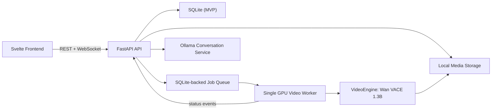

# Local Image-and-Text Video Generation System

## 1. Goal

Build a locally hosted application with two connected workflows:

1. turn a text scene description and optional reference image into a short video;
2. turn a natural-language edit request and a previously generated video into a new
   video version.

The original output is never overwritten. Every edit references a parent generated
video and produces a new child version.

The frontend and backend are independently deployable. The frontend uses Svelte.

## 2. Hardware Constraints

Target hardware:

- NVIDIA GeForce RTX 5050 Laptop GPU
- 8 GB VRAM
- CUDA 13.1 driver runtime

The system must treat GPU memory as a scarce, exclusive resource. Only one video
generation job may run at a time. Model components use CPU offload where supported.

Initial output target:

- 480p-class preview
- 49 frames
- 8 FPS
- about 6 seconds

Higher-resolution rendering is a future profile for a worker with at least 24 GB VRAM.

## 3. Model Strategy

### Initial video worker

Use Wan2.1 VACE-1.3B as the initial local video model:

- accepts a text prompt;
- can use reference images as conditioning input;
- has a 1.3B variant intended for consumer GPUs;
- can be run with offload-oriented settings.

This is a low-VRAM MVP path. It prioritizes getting a locally generated preview over
high-resolution fidelity or fast generation.

### Conversation model

Run a small local instruct model through Ollama, initially Qwen3 4B or a similarly
sized Chinese-capable instruct model.

The conversation model does not generate video. It:

1. interprets a user's edit request against a selected generated video version;
2. extracts what must change and what must be preserved;
3. produces a structured `VideoEditSpec`;
4. expands the edit prompt in Chinese and English where useful.

The LLM process must not remain on the GPU while a video job is executing.

The assistant must not silently replace the selected source video. Each follow-up is
an edit request that creates a new version with a visible parent relationship.

### Upgrade path

`VideoEngine` is an adapter boundary. A higher-VRAM worker can later run:

- Wan2.2 TI2V-5B for native text-and-image-to-video;
- LTX Video or another image-to-video engine;
- an upscaler/interpolator as a separate post-processing worker.

No frontend or API contract changes are required for this upgrade.

## 4. Architecture



### Services

| Service | Responsibility |
| --- | --- |
| `web` | Svelte UI, uploads, chat, job status, result playback |
| `api` | authentication boundary, validation, conversation orchestration, job API |
| `worker` | owns model lifecycle, runs one generation job, emits progress |
| `ollama` | local follow-up/scene-spec assistant |
| `storage` | original uploads, normalized references, generated videos, thumbnails |

### Generation modes

| Mode | Input | Output |
| --- | --- | --- |
| `create` | text prompt and optional reference image | root video version |
| `edit` | selected generated video and natural-language modification | child video version |

`edit` uses the selected output video as VACE conditioning. The edit prompt describes
the delta, while structured preservation constraints protect elements the user did not
ask to change.

### Process policy

- The API never loads the video model.
- The worker is the only process allowed to load a video model.
- Video jobs are FIFO with one active job.
- The worker records a recoverable job state before and after every stage.
- Conversation requests remain available while a video job runs, but may use CPU-only
  inference to prevent GPU contention.

## 5. Repository Layout

```text
SK2/
  apps/
    web/                    # SvelteKit frontend
    api/                    # FastAPI service
    worker/                 # GPU worker and model adapters
  packages/
    contracts/              # OpenAPI-derived TypeScript types / JSON schemas
  infra/
    compose/                # local process configuration
  data/
    media/                  # gitignored user and generated media
    models/                 # gitignored checkpoints
  DESIGN.md
```

## 6. Core Data Model

### Conversation

```text
Conversation
  id, title, created_at, updated_at

Message
  id, conversation_id, role, content, attachments_json, created_at
```

### Scene and generation

```text
VideoSpec
  id, conversation_id, version
  subject, action, setting, visual_style, camera, lighting
  duration_s, fps, aspect_ratio
  positive_prompt, negative_prompt
  reference_asset_ids

GenerationJob
  id, conversation_id, video_spec_id
  parent_generation_id
  mode: create | edit
  edit_spec_json
  engine, engine_config_json
  state, progress, error_code, error_message
  output_asset_id, created_at, started_at, completed_at

Asset
  id, kind, path, mime_type, width, height, duration_s, created_at
```

`VideoSpec.version` makes every initial generation reproducible. Each edit job stores
both its parent video ID and `edit_spec_json`, making the complete version chain
reproducible and inspectable.

### Video edit request

```text
VideoEditSpec
  source_generation_id
  requested_changes
  preserve_constraints
  prompt_delta, negative_prompt_delta
  target_duration_s, seed_strategy
```

Example:

```json
{
  "source_generation_id": "gen_001",
  "requested_changes": ["change the background from daytime to rainy night"],
  "preserve_constraints": ["keep the person identity", "keep the camera movement"],
  "seed_strategy": "reuse_parent_seed"
}
```

## 7. API Contract

| Method | Path | Purpose |
| --- | --- | --- |
| `POST` | `/api/assets` | Upload and normalize a reference image |
| `POST` | `/api/conversations` | Create a scene conversation |
| `POST` | `/api/conversations/{id}/messages` | Submit a message or follow-up |
| `GET` | `/api/conversations/{id}` | Fetch messages and latest scene brief |
| `POST` | `/api/generations` | Enqueue a generation from a `VideoSpec` |
| `POST` | `/api/generations/{id}/edits` | Create a child video version from an edit request |
| `GET` | `/api/generations/{id}` | Fetch job state and output |
| `WS` | `/api/events` | Job and progress events |

The `POST /generations/{id}/edits` response contains:

```json
{
  "assistant_message": "将保留人物和镜头运动，背景改为雨夜。",
  "edit_spec": {
    "source_generation_id": "gen_001",
    "requested_changes": ["background: rainy night"],
    "preserve_constraints": ["person identity", "camera motion"]
  },
  "ready_to_generate": true
}
```

## 8. Frontend UX

The application opens directly in a workspace rather than a marketing page.

### Main workspace

- Left column: initial scene description, reference-image upload, edit-message input.
- Center: generated video player and job progress.
- Right column: editable scene controls for duration, aspect ratio, camera movement,
  seed, and a video-version history.

### Primary flow

1. User enters a scene description and optionally uploads a reference image.
2. The user starts the first generation.
3. The UI streams queued/running/progress/completed states and displays version 1.
4. The user selects a video version and enters an edit request, for example:
   "保持人物和镜头运动，把白天改成雨夜，地面有积水反光".
5. The assistant previews the requested changes and preservation constraints.
6. The user confirms to create version 2 from version 1.
7. The user can branch from any previous video version without overwriting it.

## 9. Worker Pipeline

1. Validate and normalize the initial image or selected source video.
2. For an edit job, extract and normalize source-video frames.
3. Build a model-specific conditioning package from the source video, edit prompt,
   and preservation constraints.
4. Acquire the single GPU lock.
5. Load or activate the selected engine with low-VRAM options.
6. Generate preview frames.
7. Encode MP4 with FFmpeg.
8. Generate thumbnail and persist media metadata.
9. Release GPU resources and emit terminal status.

Failure states are explicit: `queued`, `preparing`, `running`, `encoding`,
`succeeded`, `failed`, and `cancelled`.

## 10. Acceptance Criteria for MVP

- A user can generate a root video from text plus an optional JPG/PNG reference image.
- A Chinese edit request creates a child video version from the selected source video.
- The child version retains its parent video, source seed, edit instruction, and
  preservation constraints.
- The UI receives live job status without polling.
- Generated MP4 and its source prompt are retained locally.
- One failed job does not leave GPU memory allocated or block the next job.

## 11. Installation Plan

1. Create isolated Python 3.11 environment for the worker.
2. Install a PyTorch build compatible with the detected NVIDIA driver.
3. Install ComfyUI plus the Wan/VACE workflow dependencies.
4. Download the VACE-1.3B checkpoints into `data/models/`.
5. Install Ollama and pull the small Chinese instruct model.
6. Run a text-only smoke test, then a reference-image smoke test.
7. Scaffold the SvelteKit and FastAPI services after model verification.

Model downloads are intentionally deferred until approval because they are large and
will use substantial disk space.
